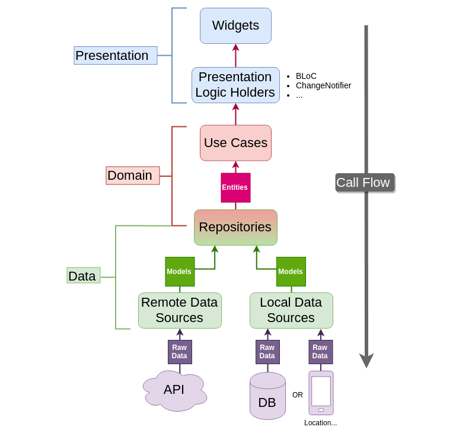

# 📚 LibroTech

**LibroTech** es una aplicación móvil innovadora diseñada para mejorar la experiencia de los entusiastas de los libros de tecnología. Ofrece una interfaz intuitiva y herramientas útiles para explorar, calificar y gestionar libros sobre tecnología.

## 🏛️ Arquitectura - Clean Architecture

LibroTech implementa **Clean Architecture** para garantizar un código modular, escalable y fácil de mantener. La arquitectura se organiza en capas bien definidas:



## 🚀 Características

- 📖 Explora libros sobre tecnología.
- ⭐ Califica y revisa libros.
- 🔎 Búsqueda rápida e intuitiva.
- 📂 Almacenamiento local con Hive.
- 🌐 Integración con APIs externas.
- 🔒 Manejo seguro de variables de entorno con `.env`.
- 🏛️ Implementación de **Clean Architecture**.

## 🛠️ Tecnologías Utilizadas

- **Flutter** (versión `>=3.3.1 <4.0.0`)
- **Dio** para la gestión de peticiones HTTP.
- **GetX** y **GetIt** para la gestión de estado y dependencias.
- **Hive** y **Hive Flutter** para almacenamiento local.
- **InAppWebView** para visualizar contenido web.
- **Dartz** para programación funcional y manejo de errores.
- **Flutter DotEnv** para variables de entorno.

## 📦 Instalación

1. **Clona el repositorio**
   ```sh
   git clone https://github.com/tu_usuario/librotech.git
   cd librotech